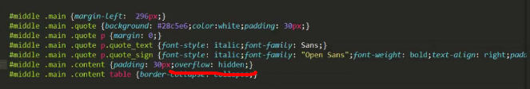
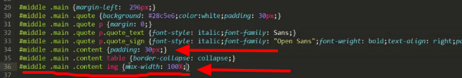
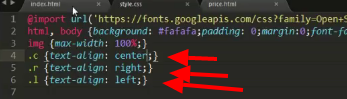

##Урок 13 Доверстываем внутренюю
- редактируем content класса main
- копируем обзац ```<p>```
- добавить ```<h2> , <h3> , <h4> ``` теги с произвольным текстом
- добавить маркерованные списки ```<ul><li>*5``` и заполнить произвольным текстом
- добавить нумерованный список ```<ol><li>*5``` текст можно из предыдущего списка
- добавить таблицу ``` table>tr*5>td*7> "текст" ``` 
- для table добвить border="1" 
- теперь изменить css - прописать для ``` #middle .main .content table ``` значение свойства ``` {border-collase: collapse;} ```
- Картинки : 
	- добавить тег img между двух обзацев (обязательно проставлять alt - автор говорил про проблемы с валидностью)
	- добавить картинку в 3000 pix 
	- первый способ настройки это скрыть все что выходит из области контент 
	
	- второй способ (более правильный) 
	 - либо это прописать для всех катринок
- также можно добавить дополнительные стили для форматирования текста
	

На этом курс закончен. 

